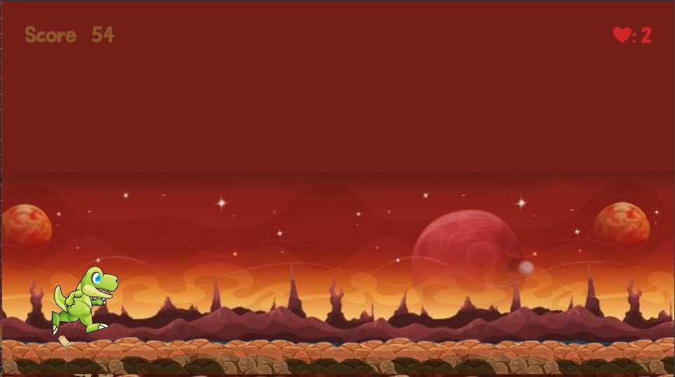

# 🦖 Dino Meteor Runner

Jogo de endless runner onde você controla um dinossauro que deve desviar de obstáculos e meteoros que caem do céu!

## 🎮 Como Jogar

- **Pular**: Pressione para cima
- **Objetivo**: Sobreviver o máximo de tempo possível
- **Vidas**: Você começa com 2 vidas
- **Vidas Extras**: Colete os corações

## ⚡ Mecânicas do Jogo

### Sistema de Meteoros

- Meteoros caem aleatoriamente do céu
- Velocidade e frequência aumentam progressivamente

### Sistema de Vidas

- Display de vidas em tempo real
- Vida coletáveis
- Game Over ao zerar vidas

### Dificuldade Progressiva

- Velocidade aumenta com o tempo
- Meteoros aparecem mais frequentemente
- Score aumenta automaticamente

## 🛠️ Tecnologias

- **Engine**: GDevelop 5
- **Linguagem**: Visual Events
- **Plataforma**:

## Imagens e vídeos

<video src="./readme/video1.mp4" controls width="500"></video>

<video src="./readme/video2.mp4" controls width="500"></video>

## 🎯 Como Jogar

### Online

[🎮 Clique aqui para jogar](https://gd.games/games/732ca8c4-e9bc-451f-bf6a-b704926d95a2)

## Local

- Baixe os arquvios pelo repositório
- Utilize a plataforma GDevelop para executar

## 👥 Desenvolvedores

- Clara Rocha Ferreira
- Davi Farias de Freitas Manzotti
- Felipe Bignoto Palacio

## 📄 Licença

Projeto educacional - GDevelop Game Engine

---

⭐ Projeto acadêmico desenvolvido com GDevelop
